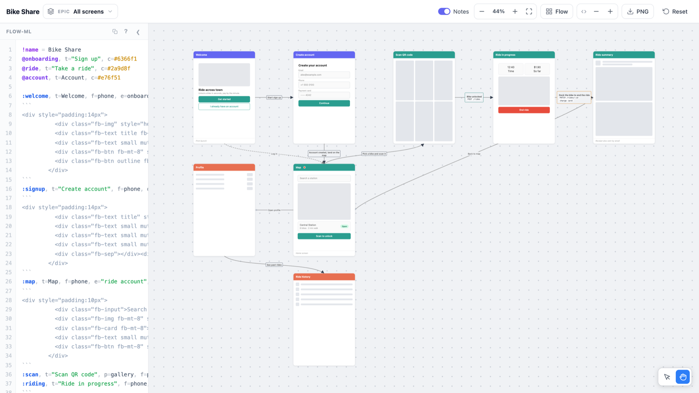
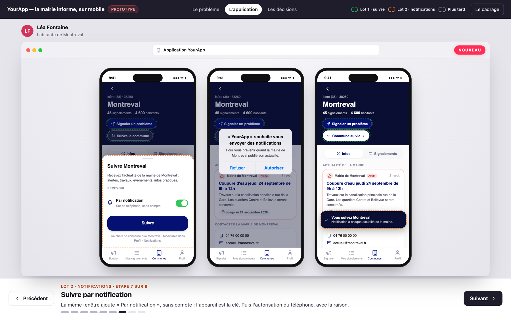

# Snowpact skills

These are the agent skills we reach for most often at [Snowpact](https://github.com/snowpact). Both help us show a product idea before anyone writes code. They work with Claude Code, Codex, Cursor, and any other agent that reads `SKILL.md` files.

## Install

The quickest route is the [skills CLI](https://skills.sh). It figures out which agents you have and puts the files in the right place:

```bash
npx skills add snowpact/snowpact-skills
```

If you only want one of them:

```bash
npx skills add snowpact/snowpact-skills --skill flowboard
```

Add `-g` to install for your user rather than the current project. Later on, `npx skills update` pulls the latest versions.

**Claude Code plugin.** You can also install from inside Claude Code:

```
/plugin marketplace add snowpact/snowpact-skills
/plugin install snowpact-skills@snowpact-skills
```

**By hand.** Each skill is just a folder, so you can clone the repo and copy (or symlink) the folders you want:

```bash
git clone https://github.com/snowpact/snowpact-skills.git
cp -r snowpact-skills/skills/* ~/.claude/skills/   # Claude Code
cp -r snowpact-skills/skills/* ~/.codex/skills/    # Codex
```

Other agents work the same way. Drop the folders into whichever directory the agent reads skills from.

## The skills

### flowboard

Turns a list of screens into an interactive storyboard: wireframe cards grouped by user journey and linked by arrows, all in one HTML file. It's built on our [html-flow-board](https://github.com/snowpact/html-flow-board) library. Open the file in a browser and you can drag screens around, wire new arrows, and edit everything as text in the side panel.

We use it early on, when we need to agree on which screens exist and how people move between them.

> "Make a flowboard for the sign-up and checkout flow."



The board above is in [`examples/flowboard-demo.html`](examples/flowboard-demo.html). Open it in a browser to try it.

### design-prototype

Builds a clickable presentation, again in a single HTML file, that replays the real screens of your app to settle a product decision. It always runs in the same order: the problem, then the journeys shown before and after the change, then the open choices with a recommendation. Every screen is tagged CURRENT or NEW, so people can see what would actually change.

The agent reads your code first and uses the app's real labels and styles, so you end up discussing your actual product instead of a generic wireframe. It also writes a short `.md` scoping note to go with the prototype.

The presentation itself (tabs, narration, phone and browser frames, slides) comes from our [html-design-proto](https://github.com/snowpact/html-design-proto) engine. The agent only writes a short scenario file, and your app's styles live in a shared `_kit/` folder that every prototype reuses.

> "Make a design prototype showing how residents would follow their town hall's news in the app."



*From one of our real projects. The product name has been swapped out and the people and town are made up.*

## Contributing

Each skill lives in `skills/<name>/SKILL.md`. To add one, create a new folder there and add its path to [`.claude-plugin/marketplace.json`](.claude-plugin/marketplace.json). Issues and PRs are welcome.

## License

MIT
